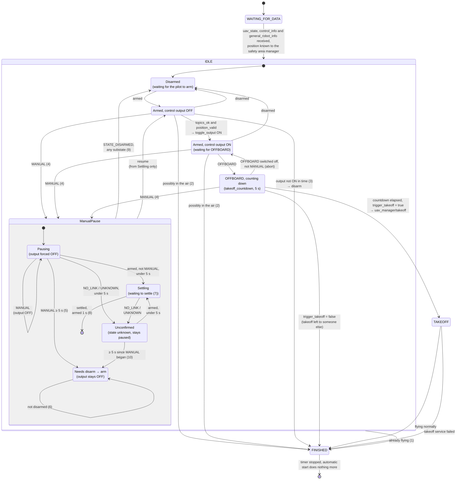

# MRS UAV Autostart

Please follow to the [documentation page](https://ctu-mrs.github.io/docs/features/autostart/).

## State machine

How `automatic_start` behaves (`src/automatic_start.cpp`, `timerMain()`, running at `main_timer_rate`). It reads everything from DiagnosticsManager (`uav_state`, `control_info`, `general_robot_info`) and acts through `control_manager/toggle_output`, `hw_api/arming` (disarm only) and `uav_manager/takeoff`.

Notes:

1. **Already flying**: `uav_state` is `TAKEOFF`, `HOVER`, `GOTO`, `TRAJECTORY`, `LAND`, `RC_MODE`, `MIDAIR`, `EHOVER`, `ELAND` or `FAILSAFE` — someone else started the flight (e.g. the node was restarted mid-air, or MRS is taking over a UAV already in the air). Finishes without touching output, arming or takeoff. `MANUAL` no longer counts as already flying — see `ManualPause` below instead.
2. **Possibly in the air**: not OFFBOARD, a preflight speed / height / gyro check failed, and the UAV is armed. Turns control output OFF if automatic start turned it ON, then finishes. While **not armed** it only warns and keeps waiting. This check can't fire during a `ManualPause` (the pause returns first), and the `Settling` wait (note 7) keeps it from firing right after a resume.
3. **Output not ON in time**: control output not ON within `arm_to_output_timeout` (1.5 s) after arming (or after the data became available) → disarm and finish. Not if the UAV was already armed when automatic start came up: then it only warns and keeps waiting.
4. **`MANUAL`**: the pilot (or the autopilot itself) is flying without offboard. Control output is forced OFF for the whole pause so MRS can't take over once OFFBOARD reappears (it would find no setpoints). `Disarmed` can't reach `ManualPause`: `uav_state == MANUAL` requires the UAV to be armed.
5. **Long `MANUAL`**: still `MANUAL` after `manual_abort_max_duration` (5 s, default) is treated as a real flight, not an aborted OFFBOARD attempt — resuming now needs an explicit disarm → arm.
6. Only an explicit `STATE_DISARMED` ends `NeedsRearm`; `NO_LINK`/`UNKNOWN` are ambiguous (not a confirmed landing) and leave the pause exactly where it was. A `MANUAL` reading after `Settling`/`Unconfirmed` goes back to `Pausing` (not drawn); the 5 s keep counting from when the first `MANUAL` began.
7. **Settling**: once a short `MANUAL` ends, resuming is deferred while the preflight speed/height/gyro heuristics still say "possibly in the air" and the UAV isn't OFFBOARD yet — otherwise resuming would immediately trip the "possibly in the air + armed" finish check (note 2) right after the pause.
8. Resume requires `armed` to be stable (uninterrupted) for 1 s once `Settling`'s condition clears.
9. `STATE_DISARMED` ends the pause from any substate (short or long): the pause and the rearm requirement are cleared and automatic start continues from `Disarmed`, so the next arm is a fresh start (the arm-to-output timeout counts from the new arming). `started_armed_` is **not** reset — it is latched once, from the first confirmed `uav_state` at node startup, so a UAV that was armed before automatic start came up is never disarmed by it, even after a pause.
10. **Unconfirmed**: `NO_LINK`/`UNKNOWN` during a short pause stays paused (warns "paused, UAV state not confirmed"). The pilot may still be flying without us seeing it, so once `manual_abort_max_duration` has passed since the `MANUAL` began, the pause needs a disarm → arm just like a long `MANUAL`. The time is measured from when the `MANUAL` began, so it includes any time already spent in `Settling`: a `NO_LINK`/`UNKNOWN` reading ≥ 5 s after the `MANUAL` began needs a rearm straight away. A slow settle that stays confirmed armed (not `MANUAL`) never requires a rearm by itself.

- The checks run in this order on every tick of `IDLE`: already flying → `MANUAL` pause/resume → preflight "possibly in the air" → arming / control output → (simulation only) Gazebo spawner finished → OFFBOARD countdown.
- Disarming is refused while in OFFBOARD.
- `FINISHED` is final: to use automatic start again, restart the node.

### Transitions and the tests that cover them

| Transition | Test (`test/`) |
|---|---|
| `WAITING_FOR_DATA` → `IDLE` | `errorgraph_clears_after_startup` (waiting-for-DiagnosticsManager error reported, then cleared) |
| `IDLE` → `FINISHED`: already flying | `already_flying_should_finish` |
| `ManualPause` → `FINISHED`: already flying (`MIDAIR`), output ON by UavManager left alone | `midair_activation_should_finish` |
| `Disarmed` → `ArmedOutputOff` → `ArmedOutputOn` | `takeoff_should_succeed` |
| `ArmedOutputOff`/`On` → `Disarmed`: disarmed (outside a `MANUAL` pause) | **no test** |
| `ArmedOutputOff` stays: `topics_ok` false | `takeoff_should_fail_topic_check` (output never ON, takeoff fails) |
| `ArmedOutputOff` stays: position outside the safety area | `takeoff_should_fail_outside_safety_area` (output never ON, takeoff fails) |
| `ArmedOutputOff`/`On` → `FINISHED`: possibly in the air + armed | `takeoff_should_fail_while_moving` |
| Already armed at startup: output ON, takeoff | `started_armed_should_take_off` |
| Already armed at startup: no disarm on the arm-to-output timeout | `started_armed_should_not_disarm` |
| `ArmedOutputOn` → `Countdown` → `TAKEOFF` → `FINISHED` (flying normally) | `takeoff_should_succeed` |
| `Countdown` → `FINISHED`: `trigger_takeoff = false` | `takeoff_triggered_externally` |
| `ArmedOutputOff`/`On`/`Countdown` → `ManualPause` (`Pausing`): `MANUAL` | `manual_flight_should_pause` (long), `offboard_abort_should_allow_retry` (short, from `Countdown`) |
| `Pausing` → `Pausing`: output forced OFF on every tick while `MANUAL` | `manual_flight_should_pause` |
| `Pausing` → `NeedsRearm`: `MANUAL` ≥ 5 s | `manual_flight_should_pause` |
| `NeedsRearm` → `NeedsRearm`: `NO_LINK` doesn't end the pause | `manual_flight_should_pause` |
| `NeedsRearm` → `Disarmed`: `STATE_DISARMED`, fresh start after arming again | `manual_flight_should_pause` |
| `Pausing` → `Unconfirmed` → `NeedsRearm`: short `MANUAL` (~2 s) + long `NO_LINK` (~5.5 s), then `ARMED` doesn't resume | `manual_flight_should_pause` |
| `Pausing`/`Settling`/`Unconfirmed` → `Disarmed`: `STATE_DISARMED` during a short pause | **no test** |
| `Pausing` → `Settling`: `MANUAL` ends before 5 s | `offboard_abort_should_allow_retry` |
| `Settling` → resume (armed stable 1 s) → `ArmedOutputOff`/`On` → `Countdown` (restarted, no takeoff for the first 3 s) → `TAKEOFF` | `offboard_abort_should_allow_retry` |
| `ArmedOutputOff` → `FINISHED`: arm-to-output timeout → disarm | **no test asserts the disarm** (the two `takeoff_should_fail_*` tests only assert that the takeoff fails) |
| `Countdown` → `ArmedOutputOn`: OFFBOARD abort *without* `MANUAL`, then retry | **no test** (`offboard_abort_should_allow_retry` covers the `MANUAL`-abort path above instead, which is what PX4 actually reports) |
| `Settling` → `Settling`: stays because speed/height/gyro not ok | **no test** (`offboard_abort_should_allow_retry`'s mock always reports the heuristics as ok) |
| `TAKEOFF` → `FINISHED`: takeoff service failed | **no test** |
| Disarm refused while in OFFBOARD | **no test** |
